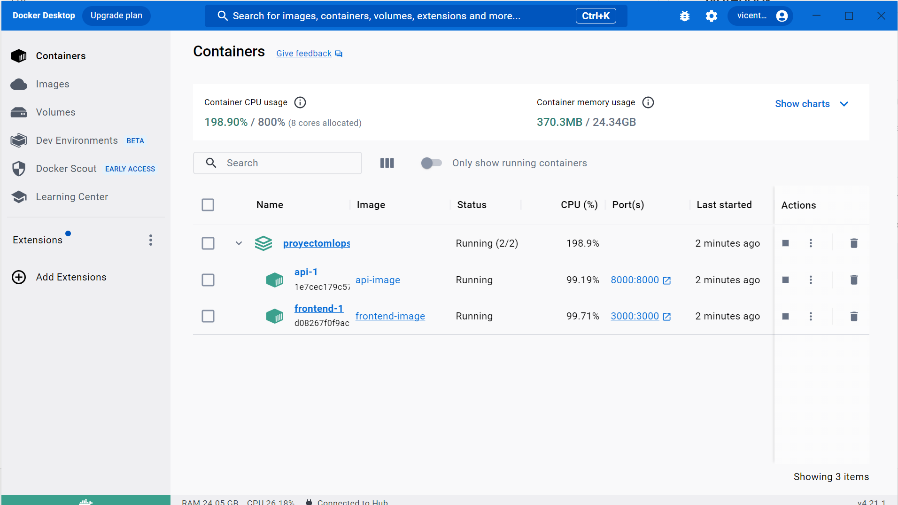
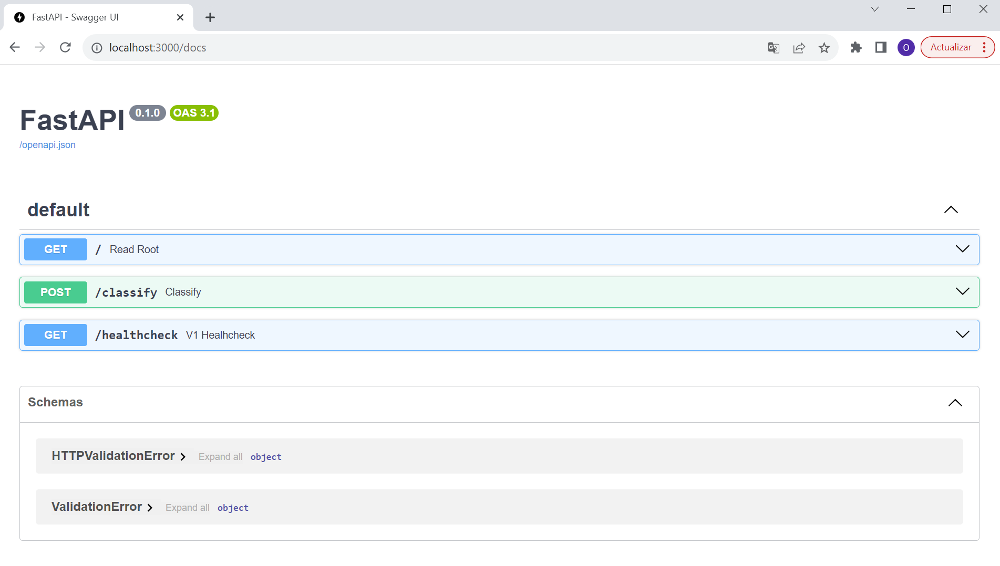
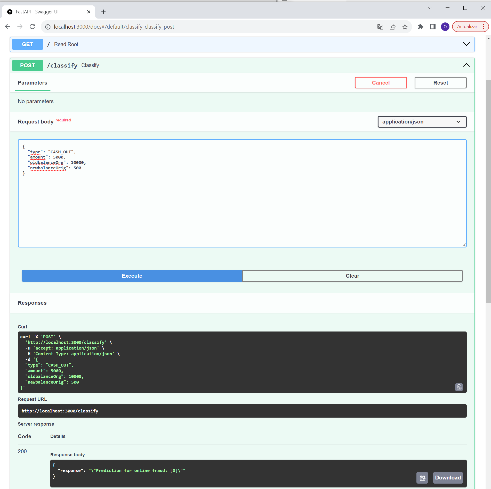
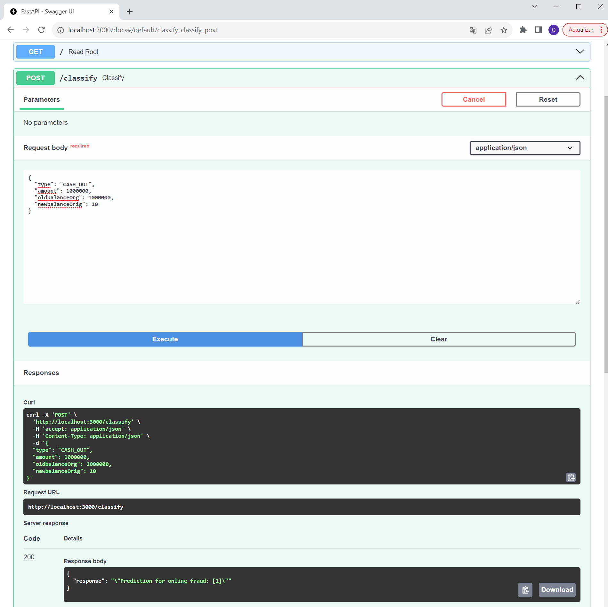

# ITESM-MLOps-Project
This repository contains the files related to first part of the final proyect 

Student ID : A01688409

Student Name : Oscar Vicente Betanzos Sánchez

Teacher: Dr. Carlos Noé López Mejía

This project uses the following dataset : 

https://www.kaggle.com/datasets/jainilcoder/online-payment-fraud-detection

This project uses the following notebook for the reference notebook

https://www.kaggle.com/code/khizarsultan/fraud-detection

# About the dataset: 
This dataset contains historical information about fraudulent transactions which can be used to detect fraud in online payments

**Features list**

**step:** represents a unit of time where 1 step equals 1 hour

**type:** type of online transaction

**amount:** the amount of the transaction

**nameOrig:** customer starting the transaction

**oldbalanceOrg:** balance before the transaction

**newbalanceOrig:** balance after the transaction

**nameDest:** recipient of the transaction

**oldbalanceDest:** initial balance of recipient before the transaction

**newbalanceDest:** the new balance of recipient after the transaction

**isFraud:** fraud transaction 


# Objective/Scope

The objective of this project is to train a machine learning model for classifying fraudulent and non-fraudulent payments using features available in the current dataset.

The current scope is limited to have the proper structure for a MLOps project with a few functionalities, modular structure and to have a simple ML model to solve the objective.

This project is basically a *Proof of Concept* for testing the proper structure of a MLOps project

# About the project requirements and venv
This project was developed using Python 3.10.9 .

Check the **requirements.txt** file for information on the packages' versions used in the project.

Check the **requirements_extended.txt** file for information on all the packages' versions used in the development.

To create virtual environment and install requirements use the following lines

```
py -3.10 -m venv venv-proy01

.\venv-proy01\Scripts\activate

pip install -r requirements.txt
```

# Main file

The main file named *main.py* has all the functions needed to solve the objective. 

This file uses functions from the modules. It loads the dataset, executes the pipeline, trains two models (logistic regression and Decision Tree) saves the models in the Models folder.

It's recommended to run this file before to download the dataset and generate the models that are used in the rest of the project. Either way, this version of the project includes the dataset files and the .pkl files in case you don't want to run this file.

To execute the main file run the following code in your root
```
python.exe main.py
```

## Load Module

This module keeps the processes to import the dataset. 

**NOTE:** The current scope of this project doesn't reach the functionality to download the dataset and store it in the *data* folder because the file is 470MB.

This new version has a URL to a balanced sample of the original dataset.

I had to make it this way to work properly in Docker

## Preprocess

This module keeps the transformations done to the dataset.

## Train

This module holds the Pipeline to preprocess the dataset and the model methods that are going to be trained with the data.

## Models

The main file exports the trained model in this file to keep the results.

## Test

This module holds tests to validate the functionalities in the other modules.

It has its own ReadMe

## Notebook

This folder keeps the original notebook

## Utilities + Logs

This folder contains a module for generating logs easily in every other module.

**IMPORTANT:** The main.py file and api.py file share a log file and this log is stored in this folder with the name **main.log**.

# API.PY

This file generates an API to generate predictions for fraud using the models that the main file generates.

To execute this file alone use the following code: (from the root where the docker-compose.yaml is located )
```
uvicorn api:app --reload
```

# FrontEnd

This folder contains the frontend_main.py file that generates the API for consulting the API predict function

To execute this file alone use the following code: (from the root where the docker-compose.yaml is located )
```
uvicorn frontend.frontend_main:app --reload
```

# Docker

This project includes a Dockerfile at the root directory to create the container for the app at the api.py file . Also includes another Dockerfiler at the frontend to create the container for the app at the frontend_main.py file

There is also a docker-compose file to handle the containers and the network between both containers.

Before building the images and containers create the network declared at the docker-compose.yaml using the following code
```
docker network create AIservice
```

To create both images and containers execute the following command
```
docker-compose up --build
```

After that, you should see two containers on your Docker Desktop like in the following image:



Please select the 3000 port to execute the FrontEnd API to check its functionalities.

# Using the FrontEnd API

The FrontEnd API makes a request to the API at api.py through the POST method, then the API makes a prediction that returns to the frontend.

At the frontend API select the classify option to test the predictions and the select the try out button.




These are two examples of results in the classify functionality for predicting Online Fraud using a Decision Tree Model

* **Prediction 1**  
    Request body

    ```bash
    {
      "type": "CASH_OUT",
      "amount": 5000,
      "oldbalanceOrg": 10000,
      "newbalanceOrig": 500
    }
    ```

    Response body
    The output will be:

    ```bash
    "Prediction for online fraud: [0]"
    ```

    

* **Prediction 1**  
    Request body

    ```bash
    {
      "type": "CASH_OUT",
      "amount": 1000000,
      "oldbalanceOrg": 1000000,
      "newbalanceOrig": 10
    }
    ```

    Response body
    The output will be:

    ```bash
    "Prediction for online fraud: [1]"
    ```

    

# Obtaining the logs in the docker containers